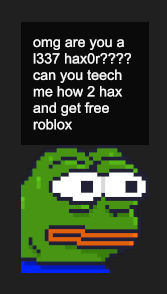

# Boy's Club

Boy's Club is clippy but pepe.

Pepe hangs around your desktop and reacts to what you're doing and, occasionally, Pepe will make jokes as well.



## How it works

Click pepe to change his face. If you're lucky, you will also see a joke.

Alt-F4 to close, probably.

## Goals

- Use a new programming language (Rust)
- Create a desktop application
- Distribute as a single file
- Support multiple platforms (Linux, Windows)

## Building from source

With the rust toolchain installed on your system, building from source is as easy as

```
cargo build
```

or

```
cargo run
```

## Dependencies

### Ubuntu

```
sudo apt-get install libfreetype6-dev
```

# Created in participation of CSSS Mountain Madness 2021

https://sfucsss.org/events/mountain_madness2021

As per the theme, the book that this project relates to very famous internet sensation [Boy's Club](https://books.google.ca/books/about/Boy_s_Club.html?id=WRYyDAAAQBAJ), by Matt Furie.
